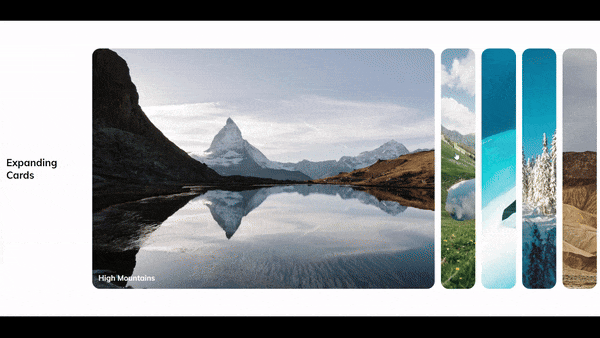

# Expanding Cards

## 🚀 Overview

This project showcases the "Expanding Cards" functionality, where clicking on a card expands it with a smooth transition effect, providing a dynamic and interactive user experience.

### 🎯 Project Goals:
- Style cards to feature a background image and heading.
- Use Flexbox for alignment and layout.
- Implement JavaScript to handle click events, triggering the card expansion by adding an active class.
- Utilize CSS transitions to create a smooth expansion effect.

## 🛠️ Built With

- [HTML5](https://www.w3schools.com/html/)
- [CSS3](https://www.w3schools.com/css/)
- [JavaScript](https://www.w3schools.com/js/)
